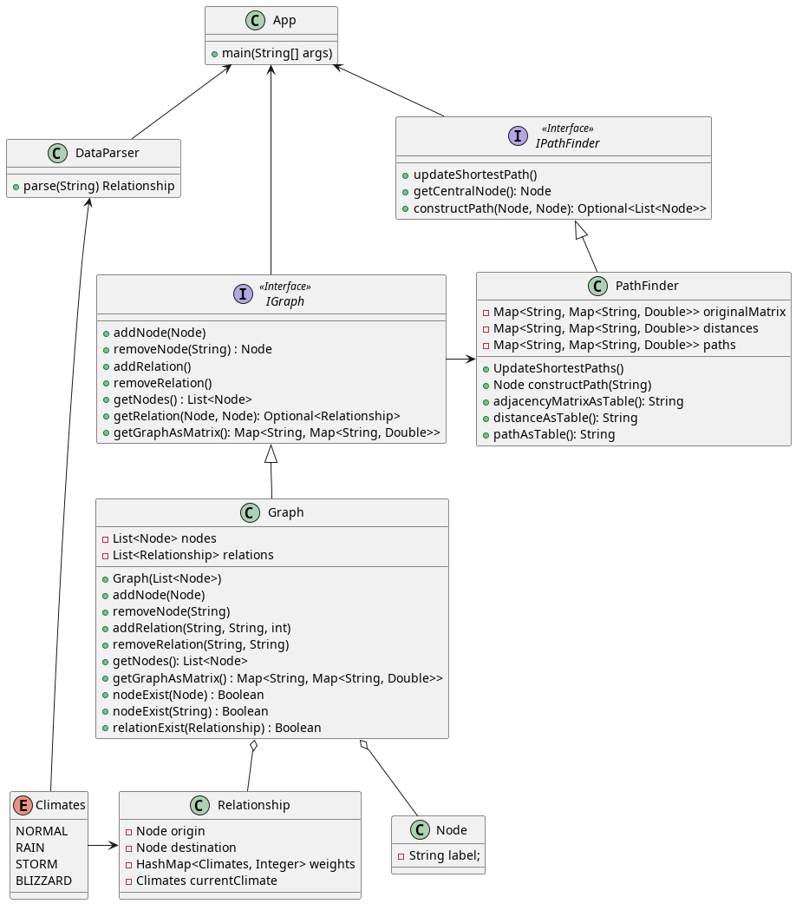

# HT 10 - Floyd's Algorithm

Created with Maven and Java 17

**Source Code:** [Here](https://github.com/DanielRasho/HT-10/tree/main/src/main/java/com/uvg/gt)

**Unit Test:** [Here](https://github.com/DanielRasho/HT-10/tree/main/src/test/java/com/uvg/gt)

